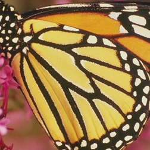

# DSGAN-PyTorch

## Overview

This repository contains an op-for-op PyTorch reimplementation
of [Frequency Separation for Real-World Super-Resolution](https://arxiv.org/pdf/1911.07850.pdf)
.

## Table of contents

- [DSGAN-PyTorch](#dsgan-pytorch)
    - [Overview](#overview)
    - [Table of contents](#table-of-contents)
    - [Download weights](#download-weights)
    - [Download datasets](#download-datasets)
    - [How Test and Train](#how-test-and-train)
        - [Test](#test)
        - [Train DSGAN model](#train-dsgan-model)
        - [Resume train DSGAN model](#resume-train-dsgan-model)
    - [Result](#result)
    - [Contributing](#contributing)
    - [Credit](#credit)
        - [Frequency Separation for Real-World Super-Resolution](#frequency-separation-for-real-world-super-resolution)

## Download weights

- [Google Driver](https://drive.google.com/drive/folders/17ju2HN7Y6pyPK2CC_AqnAfTOe9_3hCQ8?usp=sharing)
- [Baidu Driver](https://pan.baidu.com/s/1yNs4rqIb004-NKEdKBJtYg?pwd=llot)

## Download datasets

Contains DIV2K, DIV8K, Flickr2K, OST, T91, Set5, Set14, BSDS100 and BSDS200, etc.

- [Google Driver](https://drive.google.com/drive/folders/1A6lzGeQrFMxPqJehK9s37ce-tPDj20mD?usp=sharing)
- [Baidu Driver](https://pan.baidu.com/s/1o-8Ty_7q6DiS3ykLU09IVg?pwd=llot)

Please refer to `README.md` in the `data` directory for the method of making a dataset.

## How Test and Train

Both training and testing only need to modify the `config.py` file.

### Test

modify the `config.py`

- line 32: `g_arch_name` change to `dsgan`.
- line 46: `upscale_factor` change to `4`.
- line 48: `mode` change to `test`.
- line 98: `g_model_weights_path` change to `./results/pretrained_models/DSGAN_x4-DF2K_Gaussian.pth.tar`.
-

```bash
python3 test.py
```

### Train DSGAN model

modify the `config.py`

- line 31: `d_arch_name` change to `discriminator`.
- line 32: `g_arch_name` change to `dsgan`.
- line 46: `upscale_factor` change to `4`.
- line 48: `mode` change to `train`.

```bash
python3 train.py
```

### Resume train DSGAN model

modify the `config.py`

- line 31: `d_arch_name` change to `discriminator`.
- line 32: `g_arch_name` change to `dsgan`.
- line 46: `upscale_factor` change to `4`.
- line 48: `mode` change to `train`.
- line 66: `resume_d` change to `./samples/DSGAN_x4-DF2K_Gaussian/d_epoch_xxx.pth.tar`.
- line 67: `resume_g` change to `./samples/DSGAN_x4-DF2K_Gaussian/g_epoch_xxx.pth.tar`.

```bash
python3 train.py
```

## Result

Source of original paper results: [https://arxiv.org/pdf/1911.07850.pdf](https://arxiv.org/pdf/1911.07850.pdf)

```bash
# Download `DSGAN_x4-DF2K_Gaussian.pth.tar` weights to `./results/pretrained_models`
# More detail see `README.md<Download weights>`
python3 ./inference.py
```

Input:

<span align="center"></span>

Output:

<span align="center"></span>

```text
Build `dsgan` model successfully.
Load `dsgan` model weights `./results/pretrained_models/DSGAN_x4-DF2K_Gaussian.pth.tar` successfully.
LR image save to `./figure/butterfly_gt.png`
```

## Contributing

If you find a bug, create a GitHub issue, or even better, submit a pull request. Similarly, if you have questions,
simply post them as GitHub issues.

I look forward to seeing what the community does with these models!

## Credit

### Frequency Separation for Real-World Super-Resolution

_Manuel Fritsche, Shuhang Gu, Radu Timofte_ <br>

**Abstract** <br>
Most of the recent literature on image super-resolution (SR) assumes the availability of training data in the form of
paired low resolution (LR) and high resolution (HR) images or the knowledge of the downgrading operator (usually bicubic
downscaling). While the proposed methods perform well on standard benchmarks, they often fail to produce convincing
results in real-world settings. This is because real-world images can be subject to corruptions such as sensor noise,
which are severely altered by bicubic downscaling. Therefore, the models never see a real-world image during training,
which limits their generalization capabilities. Moreover, it is cumbersome to collect paired LR and HR images in the
same source domain.
To address this problem, we propose DSGAN to introduce natural image characteristics in bicubically downscaled images.
It can be trained in an unsupervised fashion on HR images, thereby generating LR images with the same characteristics as
the original images. We then use the generated data to train a SR model, which greatly improves its performance on
real-world images. Furthermore, we propose to separate the low and high image frequencies and treat them differently
during training. Since the low frequencies are preserved by downsampling operations, we only require adversarial
training to modify the high frequencies. This idea is applied to our DSGAN model as well as the SR model. We demonstrate
the effectiveness of our method in several experiments through quantitative and qualitative analysis. Our solution is
the winner of the AIM Challenge on Real World SR at ICCV 2019.

[[Paper]](https://arxiv.org/pdf/1911.07850.pdf) [[Code]](https://github.com/ManuelFritsche/real-world-sr)

```bibtex
@inproceedings{fritsche2019frequency,
author={Manuel Fritsche and Shuhang Gu and Radu Timofte},
title ={Frequency Separation for Real-World Super-Resolution},
booktitle={IEEE/CVF International Conference on Computer Vision (ICCV) Workshops},
year = {2019},
}
```
